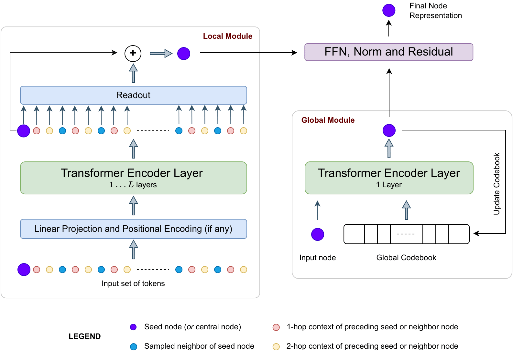

# LargeGT: Graph Transformers for Large Graphs

Source code for the paper **Graph Transformers for Large Graphs** 
>by [Vijay Prakash Dwivedi](http://vijaydwivedi.com.np), [Yozen Liu](https://research.snap.com/team/team-member.html#yozen-liu), [Anh Tuan Luu](https://tuanluu.github.io), [Xavier Bresson](https://scholar.google.com/citations?user=9pSK04MAAAAJ&hl=en), [Neil Shah](https://nshah.net) and [Tong Zhao](https://tzhao.io).

The paper proposes LargeGT which is a scalable Graph Transformer framework designed to efficiently handle large-scale graphs, featuring a combination of fast neighborhood sampling and local-global attention mechanisms.  



## 1. Installation

To setup the Python environment with conda, [follow these instructions](./docs/01_installation.md).

## 2. Download data

Download preprocessed data by [running this script](./data/download_data.sh) as:
```
cd data  
bash download_data.sh
```

## 3. Run experiments

To run an experiment, run the command:

```
python main.py --dataset <dataset name> --sample_node_len <value of K>
```

For example:
```
python main.py --dataset ogbn-products --sample_node_len 100
```

To reproduce results, [follow these steps](./docs/03_reproduce.md).

## 4. Acknowledgement

This code repository leverages the open-source codebases released by [GOAT](https://github.com/devnkong/GOAT) and [NAGphormer](https://github.com/JHL-HUST/NAGphormer).

## 5. Reference

:page_with_curl: Paper [on arXiv](https://arxiv.org/abs/2310.xxxxx)

```bibtex
@article{dwivedi2023graph,
  title={Graph Transformers for Large Graphs},
  author={Dwivedi, Vijay Prakash and Liu, Yozen and Luu, Anh Tuan and Bresson, Xavier and Shah, Neil and Zhao, Tong},
  journal={arXiv preprint arXiv:2310.xxxxx},
  year={2023}
}

```

## 5. Reference

Please contact vijaypra001@e.ntu.edu.sg for any questions.